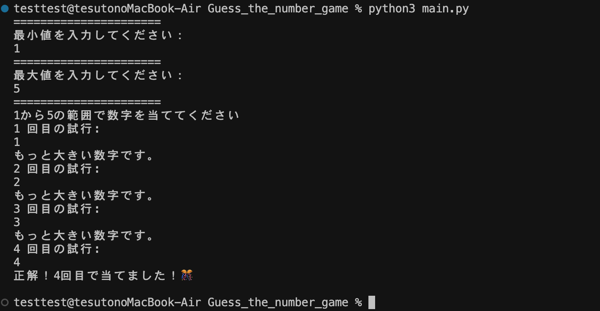

# 🎯 数当てゲーム（Guess the Number Game）

## 📝 概要

最小値と最大値を入力して、コンピュータがランダムに選んだ数字を当てるシンプルなPythonゲームです。

## 🖼️ ゲーム画面



## ✅ 機能

- ユーザーが最小値・最大値を入力して範囲を指定できる
- 指定範囲内の乱数を自動生成
- 入力が範囲外または数値でない場合のエラーメッセージ表示
- 最大5回までのチャレンジ制限（正解すれば終了）
- 数字が正解より大きいか小さいかのヒントを表示
- 最後まで正解できなかった場合は答えを表示

## 💻 実行方法

```bash
python3 game.py
